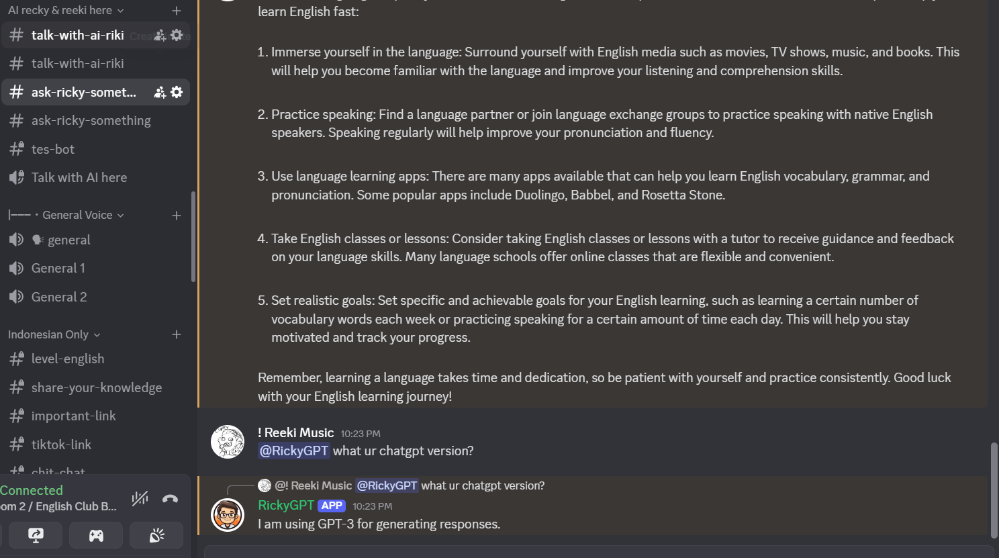

ChatGPT Discord Bot 🤖💬

Bot Discord yang terintegrasi dengan OpenAI (ChatGPT) untuk memberikan jawaban cerdas langsung dari Discord! Dibuat dengan Node.js dan mudah untuk dikembangkan atau digunakan ulang.

---
🚀 Fitur

- Menggunakan OpenAI GPT untuk menjawab pertanyaan.
- Bot Discord aktif merespons perintah.
- Konfigurasi mudah menggunakan file `.env`.

---
🔧 Instalasi

1. Clone Repository

git clone https://github.com/ricky-arianto/ChatGPT-discord.git
cd ChatGPT-discord

2. Install Dependencies
npm install

3. Buat File .env
 isi token nya sesuai dengan milik anda
DISCORD_TOKEN=your-discord-bot-token
OPENAI_API_KEY=your-openai-api-key

4. jalankan bot
node index.js

📁 Struktur Folder
ChatGPT-discord/
│
├── index.js             # File utama
├── package.json         # Konfigurasi npm
├── .env.example         # Contoh konfigurasi environment
├── .gitignore           # Mengabaikan file .env
└── README.md            # Dokumentasi proyek

💡 Tips
Jangan pernah mengupload file .env ke GitHub.

Kamu bisa mendapatkan OpenAI API Key.https://platform.openai.com/account/api-keys

Kamu bisa membuat bot token di Discord Developer Portal. https://discord.com/developers/applications

🛡️ Lisensi
MIT License – bebas digunakan, silakan modifikasi dan kembangkan.

📬 Kontak
Dibuat oleh Ricky Arianto

Contoh respon Bot

